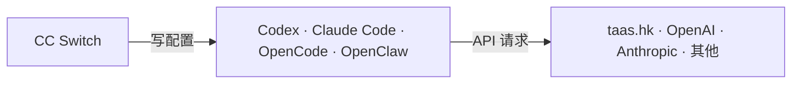

# CC Switch 使用指南

[CC Switch](https://github.com/farion123/cc-switch) 是本机上的 **Agent 配置管理工具**：保存多套 API 供应商预设，切换时写入各 Agent 的配置文件。API 请求由 Agent **直连**供应商，不经过 CC Switch。

---

## 关系示意

CC Switch 只连 Agent，不连供应商。

---

## 职责

| 做 | 不做 |
|----|------|
| 保存供应商预设（`~/.cc-switch/cc-switch.db`） | 转发 API 流量 |
| 切换时写入 Agent 配置文件 | 替代 Agent 安装 |
| 可选同步 MCP 配置 | 管理 Agent 会话历史 |

---

## 写入的配置文件

| Agent | 文件 |
|-------|------|
| Codex | `~/.codex/config.toml`、`~/.codex/auth.json` |
| Claude Code | `~/.claude/settings.json` |
| OpenCode | `~/.config/opencode/opencode.json` |
| OpenClaw | `~/.openclaw/openclaw.json` |

也可手改上述文件；CC Switch 编辑当前供应商时会回读变更。

---

## 是否必需

不必。各 Agent 均可直接改配置文件接入 taas.hk，参见 [Codex](./codex.md)、[Claude Code](./claude-code.md)、[OpenCode](./opencode.md) 指南。

---

## 添加 taas.hk 供应商

### Codex

| 字段 | 值 |
|------|-----|
| Base URL | `https://taas.hk/v1` |
| API Key | `sk-...` |
| 模型 | `gpt-5.5` |
| Wire API | `responses` |

切换后完全退出 Codex（macOS：`Cmd+Q`）再打开。

### Claude Code（CLI）

| 字段 | 值 |
|------|-----|
| Base URL | `https://taas.hk`（不带 `/v1`） |
| API Key | `sk-...` |

CLI 可直连；接 GPT 模型时运行 `claude --model gpt-5.5`。

### Claude Desktop

独立面板。接 taas.hk **GPT** 模型时：

1. 开启 **需要模型映射**
2. 配置 Sonnet/Opus/Haiku → 实际请求模型（如 `gpt-5.5`）
3. 开启 **本地路由**，保持 CC Switch 运行
4. 重启 Claude Desktop

详见 [Claude Code 使用指南 · Desktop](./claude-code.md#3-taashk-接入-desktopcowork-on-3p)。

### OpenCode

| 字段 | 值 |
|------|-----|
| Base URL | `https://taas.hk/v1` |
| API Key | `sk-...` |
| Provider 包 | `@ai-sdk/openai-compatible` |
| 模型 | `gpt-5.5` |

### OpenClaw

在 OpenClaw 槽位按 CC Switch 界面提示填写；配置写入 `~/.openclaw/openclaw.json`。

---

## 切换供应商

在对应 Agent 槽位选择目标供应商，然后：

- **Codex**：完全退出（`Cmd+Q`）再打开
- **Claude Code（CLI）**：重新运行 `claude`
- **Claude Desktop**：完全退出并重启；映射模式需保持 CC Switch 与本地路由开启
- **OpenCode / OpenClaw**：重启对应 Agent

切换供应商会改写 Codex 的 `model_provider`，侧边栏历史可能变化，见 [Codex 使用须知](./codex.md#使用须知)。

---

## 常见问题

**Claude Code 的 Base URL 为什么不带 `/v1`？**

CLI 会自动拼接 `/v1/messages`，填 `https://taas.hk/v1` 会导致路径重复。

---

## 相关文档

- [Codex 使用指南](./codex.md)
- [Claude Code 使用指南](./claude-code.md)
- [OpenCode 使用指南](./opencode.md)
- [taas.hk 用户指南](../README.md)
