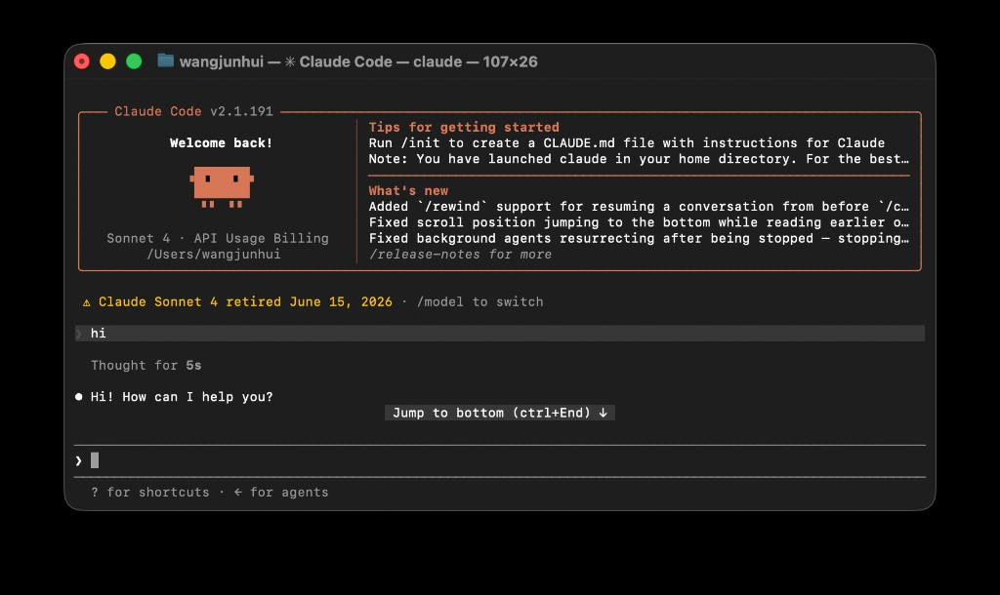

# Claude Code 使用指南

[Claude Code](https://code.claude.com/docs/en/overview) 是 Anthropic **厂商 Agent**。本文说明官方配置与 taas.hk 网关的手动接入步骤。

**前置**：已在 taas.hk 创建令牌，见 [README · 创建令牌](../README.md#创建令牌)。

---

## 1. 官方配置

| 入口 | 说明 |
|------|------|
| **CLI** | `claude` |
| **Desktop** | Claude 桌面应用 **Code** 标签页（macOS / Windows） |

| 计费 | 说明 |
|------|------|
| **订阅** | Pro / Max / Team / Enterprise |
| **API** | [Anthropic Console](https://console.anthropic.com/) API key |

CLI 与 Desktop 首次使用通常以 Anthropic 账号登录。Desktop 默认 **1P** 模式，推理走 Anthropic 官方基础设施，无需改 Base URL。

---

## 2. taas.hk 网关接入 · CLI

按以下 8 步完成配置与验证。全程**直连** taas.hk，不依赖 CC Switch。

**连接参数（步骤 3 会用到）**

| 项 | 值 |
|----|-----|
| Base URL | `https://taas.hk`（根域，**不带** `/v1`） |
| API Key | `ANTHROPIC_API_KEY=sk-...` |
| 协议 | Anthropic Messages（CLI 自动拼接 `/v1/messages`） |

勿填 `https://taas.hk/v1`，否则路径会变成 `/v1/v1/messages`。

---

### 第 1 步：确认 Claude CLI 已安装

```bash
claude --version
```

期望看到版本号，例如 `2.1.x (Claude Code)`。

---

### 第 2 步：退出 CC Switch

若 [CC Switch](./cc-switch.md) 在运行，先退出，避免覆盖 `~/.claude/settings.json`：

**macOS**

```bash
osascript -e 'quit app "CC Switch"'
```

**Windows**：托盘右键 CC Switch → Exit。

确认未运行：

```bash
pgrep -lf "cc-switch"    # macOS / Linux，无输出即正常
```

---

### 第 3 步：写入配置

把 `sk-your-token` 替换为 taas.hk 令牌。

**macOS（zsh / bash）**

```bash
mkdir -p ~/.claude
cat > ~/.claude/settings.json <<'EOF'
{
  "env": {
    "ANTHROPIC_BASE_URL": "https://taas.hk",
    "ANTHROPIC_API_KEY": "sk-your-token",
    "ANTHROPIC_DEFAULT_SONNET_MODEL": "claude-sonnet-4.6",
    "ANTHROPIC_DEFAULT_OPUS_MODEL": "claude-opus-4.8",
    "ANTHROPIC_DEFAULT_HAIKU_MODEL": "claude-haiku-4.5",
    "ANTHROPIC_MODEL": "claude-sonnet-4.6"
  }
}
EOF
```

**Windows（PowerShell）**

```powershell
New-Item -ItemType Directory -Force "$env:USERPROFILE\.claude" | Out-Null
@'
{
  "env": {
    "ANTHROPIC_BASE_URL": "https://taas.hk",
    "ANTHROPIC_API_KEY": "sk-your-token",
    "ANTHROPIC_DEFAULT_SONNET_MODEL": "claude-sonnet-4.6",
    "ANTHROPIC_DEFAULT_OPUS_MODEL": "claude-opus-4.8",
    "ANTHROPIC_DEFAULT_HAIKU_MODEL": "claude-haiku-4.5",
    "ANTHROPIC_MODEL": "claude-sonnet-4.6"
  }
}
'@ | Set-Content -Path "$env:USERPROFILE\.claude\settings.json" -Encoding UTF8
```

配置文件路径：

| 环境 | 路径 |
|------|------|
| macOS | `~/.claude/settings.json` |
| Windows | `%USERPROFILE%\.claude\settings.json` |

**模型映射说明**：交互模式默认 Opus 时，CLI 内部 id 为 `claude-opus-4-8`，taas.hk 须用 `claude-opus-4.8`（点号）。缺少上述 `ANTHROPIC_DEFAULT_*_MODEL` 时，界面可能显示正常但请求报 `API error` 并不断重试。

---

### 第 4 步：检查配置文件

```bash
cat ~/.claude/settings.json    # Windows: type %USERPROFILE%\.claude\settings.json
```

确认：

- `ANTHROPIC_BASE_URL` 为 `https://taas.hk`
- `ANTHROPIC_API_KEY` 为你的 `sk-...`
- 文件**非空**（若为 0 字节，回到第 3 步重写，并确认 CC Switch 已退出）

---

### 第 5 步：curl 测网关

`curl` **不会**读取 `settings.json`，命令里须写真实令牌。

**macOS（zsh / bash）**

```bash
curl -X POST https://taas.hk/v1/messages \
  -H "x-api-key: sk-your-token" \
  -H "anthropic-version: 2023-06-01" \
  -H "Content-Type: application/json" \
  -d '{"model":"claude-sonnet-4.6","max_tokens":32,"messages":[{"role":"user","content":"hello"}]}'
```

**Windows（PowerShell）**

```powershell
curl.exe -X POST https://taas.hk/v1/messages `
  -H "x-api-key: sk-your-token" `
  -H "anthropic-version: 2023-06-01" `
  -H "Content-Type: application/json" `
  -d '{"model":"claude-sonnet-4.6","max_tokens":32,"messages":[{"role":"user","content":"hello"}]}'
```

期望：返回 JSON，`content[0].text` 有正常回复。

可选：查可用模型列表

```bash
curl -H "Authorization: Bearer sk-your-token" https://taas.hk/v1/models
```

---

### 第 6 步：检查 Claude CLI 登录状态

```bash
claude auth status
```

期望：

```json
"loggedIn": true
```

若为 `false`，回到第 4 步检查配置。

---

### 第 7 步：验证 Claude CLI 调用

```bash
claude -p "Reply OK" --model claude-sonnet-4.6 < /dev/null
```

期望：终端输出 `OK`。

可选：测 Opus

```bash
claude -p "Reply OK" --model claude-opus-4.8 < /dev/null
```

**GPT 模型**（如 `gpt-5.5`）须显式指定，且令牌须有权限：

```bash
claude -p "Reply OK" --model gpt-5.5 < /dev/null
```

---

### 第 8 步：交互使用

```bash
claude
```

进入后发消息测试。若界面显示 Opus 且仍报 `API error`，指定 Sonnet 启动：

```bash
claude --model claude-sonnet-4.6
```

配置成功时，终端应出现 Claude Code 欢迎界面，并能正常回复，例如：



---

**步骤汇总**

| 步骤 | 操作 | 通过标准 |
|------|------|----------|
| 1 | `claude --version` | 有版本号 |
| 2 | 退出 CC Switch | 未运行 |
| 3 | 写 `settings.json` | 含 Base URL、Key、模型映射 |
| 4 | `cat settings.json` | 内容正确、非空 |
| 5 | `curl` 测网关 | JSON 有回复 |
| 6 | `claude auth status` | `loggedIn: true` |
| 7 | `claude -p ...` | 输出 `OK` |
| 8 | `claude` | 可正常对话 |

**CC Switch（可选）**：若用 CC Switch 管理 Claude 槽位，见 [cc-switch.md](./cc-switch.md)。与本文直连配置二选一即可；同时启用时 CC Switch 可能改写 `settings.json`。

---

## 3. taas.hk 网关接入 · Desktop

Claude Desktop 默认 **1P**（First Party）：登录 Anthropic 账号，推理走官方，界面会出现 **Free plan · Upgrade**、**Upgrade to Claude Pro** 等订阅提示。

接 taas.hk 须切 **3P**（Third Party，[Cowork on 3P](https://claude.com/docs/cowork/3p/overview)）：推理走你配置的 Gateway，**计费与配额由 taas.hk 令牌决定**，不再走 Anthropic 订阅。

| | 1P（默认） | 3P + taas.hk |
|--|-----------|--------------|
| 登录 | Sign in Anthropic 账号 | 登录页选 **Cowork on 3P**，不 Sign in |
| 界面特征 | 显示账号名、Free/Pro 升级提示 | 无 Anthropic 订阅升级条 |
| 配置文件 | `~/Library/Application Support/Claude/` | `~/Library/Application Support/Claude-3p/` |
| 推理去向 | api.anthropic.com | `https://taas.hk` |

**常见误区**：在 Developer 里填好 Gateway 并 Apply locally，但仍 Sign in 官方账号 → 实际仍在 **1P**，模型菜单仍引导 Pro 升级，**网关不会生效**。Configure 只是写入 profile；**启动时必须选 3P**。

### 连接参数

| 项 | 值 |
|----|-----|
| Base URL | `https://taas.hk`（根域，**不带** `/v1`） |
| API Key | taas.hk 令牌 `sk-...` |
| Auth scheme | **x-api-key**（非默认 bearer） |
| 协议 | Anthropic Messages（Desktop 自动拼接 `/v1/messages`） |

### 步骤一 · 验证网关（可选，建议先做）

确认令牌与模型可用后再配 Desktop。Claude 模型示例（plus 令牌常见可用 id）：

```bash
curl -X POST https://taas.hk/v1/messages \
  -H "x-api-key: sk-your-token" \
  -H "anthropic-version: 2023-06-01" \
  -H "Content-Type: application/json" \
  -d '{"model":"claude-sonnet-4.6","max_tokens":32,"messages":[{"role":"user","content":"ping"}]}'
```

返回 `"text":"pong"` 或类似内容即连通。可用模型列表：

```bash
curl -H "Authorization: Bearer sk-your-token" https://taas.hk/v1/models
```

### 步骤二 · 写入 Gateway 配置

1. **完全退出** Claude Desktop（macOS `Cmd+Q`；Windows 托盘右键 Exit）。只关窗口不够。
2. 重新打开，**停在登录页**，先 **不要** Sign in。
3. **Help → Troubleshooting → Enable Developer Mode**（首次需开；已开过则菜单栏直接有 **Developer**）。
4. **Developer → Configure third-party inference**。
5. **Connection** 区：

| 字段 | 填什么 |
|------|--------|
| Inference provider | **Gateway** |
| Gateway base URL | `https://taas.hk` |
| Gateway API key | 你的 `sk-...` |
| Gateway auth scheme | **x-api-key** |
| Model discovery | 建议开启（从网关 `/v1/models` 拉取 Claude 模型） |

6. 点 **Apply locally**。应用会写入本地 profile 并重启。

配置落盘位置（一般无需手改）：

| 环境 | 路径 |
|------|------|
| macOS | `~/Library/Application Support/Claude-3p/configLibrary/` |
| Windows | `%LOCALAPPDATA%\Claude-3p\configLibrary\` |

其中 `_meta.json` 记录当前启用的 profile；每个 profile 为 `{uuid}.json`，**id 必须是 36 位 UUID**（见 [排错](#desktop-排错)）。

### 步骤三 · 以 3P 模式启动（必做）

Apply locally 重启后若又回到官方登录页：

1. **不要**点 Sign in / 用你的 Anthropic 账号登录。
2. 选 **Cowork on 3P** / **Start with third-party inference**（文案因版本略有差异）。
3. 进入主界面后，打开 **Code** 或 **Cowork** 标签，选 **Sonnet**（或 Opus / Haiku），发 `ping` 测试。

若当前已登录官方账号（左下角显示 `用户名 · Free`、模型旁有 **Upgrade to Claude Pro**），说明仍在 1P：**Settings → Sign out** → 完全退出 → 重启 → 登录页选 **Cowork on 3P**。

### 步骤四 · 确认已走网关

| 检查项 | 3P + taas.hk 正常 | 仍在 1P |
|--------|-------------------|---------|
| 左下角账号 | 无 Anthropic Free/Pro 标识 | 如 `PaulWang · Free` |
| 顶部 | 无 **Free plan · Upgrade** | 有订阅升级条 |
| 模型菜单 | Sonnet/Opus/Haiku，**无** Pro 升级按钮 | 模型旁 **Upgrade to Claude Pro** |
| 对话 | 正常回复 | 可能提示需 Pro |

仍不确定时，macOS 可查看 `~/Library/Logs/Claude/main.log`，3P 启动后应有 `inference apiHost=https://taas.hk` 或 `provider: 'gateway'` 类日志。

### 模型说明

Desktop 模型菜单**固定**显示 **Sonnet / Opus / Haiku** 角色名，不会直接显示 `gpt-5.5` 或完整 upstream id。

| 网关上的模型 | Desktop 用法 |
|-------------|-------------|
| `claude-sonnet-4.6` 等 Claude id | 开启 model discovery 后，选 **Sonnet** 等角色即可直连 |
| `gpt-5.5` 等非 Claude id | Desktop 内无法映射；须 [CC Switch · Claude Desktop](./cc-switch.md#claude-desktop) 做模型映射 |

**GPT 走网关不在本节范围**；本节仅覆盖 Desktop 原生 Gateway 直连 Claude 模型。

### Desktop 排错

**Configure Third-Party Inference 显示 Couldn't load configuration**

日志（macOS：`~/Library/Logs/Claude/main.log`）常见 `readConfig failed unknown config id`。原因：`configLibrary/_meta.json` 里 profile **id 不是 UUID**（须 36 位，如 `589df5a7-1e0d-435d-b2ff-7c82383a02ac`），或 `appliedId` 无对应 `{uuid}.json`。修复：在 UI 中 **Apply locally** 重建；勿用手写 `taas-hk.json` 这类非 UUID 文件名。

**找不到 Enable Developer Mode**

须在**登录页、未 Sign in** 时：**Help → Troubleshooting → Enable Developer Mode**。已登录 1P 时先 Sign out。开启后，已登录时也可从 **Developer** 菜单进入 Configure。

**已 Configure 但仍像官方界面**

几乎总是未以 **Cowork on 3P** 启动。Sign out → `Cmd+Q` 完全退出 → 重启 → 登录页选 3P，不要 Sign in Anthropic。

**3P 下对话报错 / model not found**

确认 taas.hk 令牌对该 model id 有权限（步骤一 curl 同模型测试）。plus 令牌通常无 `gpt-5.5`，需 pro 令牌或换 Claude 模型 id。

---

## 常见问题

**CLI 与 Desktop 配置互通吗？**  
不互通。CLI 用 `~/.claude/settings.json`；Desktop 3P 用 `Claude-3p/configLibrary/`。两处需分别配置。

**Configure 之后还要 Sign out 吗？**  
要。Configure 只保存 Gateway profile；**每次要以 3P 启动**才走 taas.hk。已 Sign in 官方账号时需 Sign out，重启后在登录页选 Cowork on 3P。

**模型菜单为什么还像官方的？**  
Desktop UI 固定显示 Sonnet/Opus/Haiku 角色名。若在 3P 下，请求实际发往 taas.hk；若见 **Upgrade to Claude Pro**，说明仍在 1P。

---

## 相关文档

[接入指南总览](../README.md)
